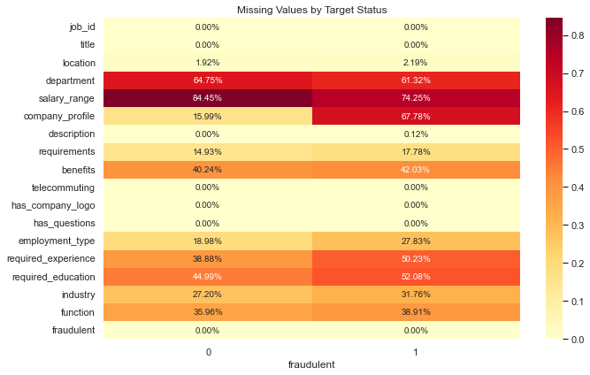
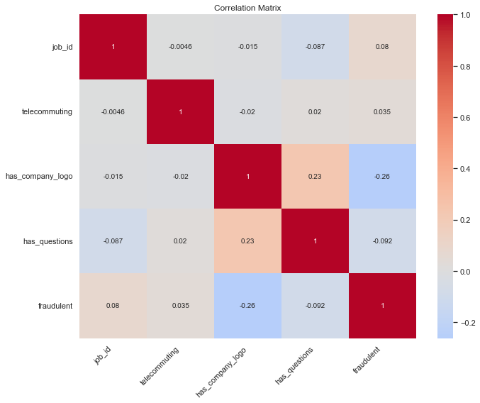

# Fraud Detection in Job Postings: A Comprehensive ML Pipeline Tutorial
https://github.com/vjfrosty/Fraud-Detection-in-Job-Postings-A-Comprehensive-ML-Pipeline-Tutorial
## 1. Problem Understanding and Significance

### Problem Statement
Fraudulent job postings pose a significant threat to job seekers, potentially leading to financial losses, identity theft, and wasted time. This project develops a machine learning solution to automatically detect fraudulent job postings, helping protect job seekers and maintain the integrity of job platforms.

### Project Objectives
1. Build an end-to-end ML pipeline for fraud detection
2. Demonstrate effective handling of imbalanced text data
3. Compare and optimize multiple ML models
4. Create a reproducible workflow for similar classification tasks

### Significance
- **Technical Value**: Addresses common ML challenges (imbalanced data, text processing)
- **Educational Merit**: Demonstrates practical implementation of advanced ML concepts

## 2. Methodology and Implementation

### Data Analysis ([01.DataLoading_and_EDA](notebooks/01.DataLoading%20and%20EDA.ipynb))
- Data loading and initial inspection (cells 1-2)
- Exploratory analysis using `DataAnalyzer` transformer (cells 3-4)
- Target variable analysis using `TargetAnalyzer` (cells 5-6)
- Text and categorical feature analysis (cells 7-8)


- **Target Distribution**:
  - Legitimate Jobs (0): 17,014 (95.16%)
  - Fraudulent Jobs (1): 866 (4.84%)
  - Highly imbalanced classification problem
#### Dataset Statistics
- **Missing Value Analysis**:
  - Total Cells: 321,840
  - Total Missing: 70,103
  - Percentage Missing: 21.78%




### Feature Correlations


**Binary Feature Correlations with Fraud**:
1. **Company Logo (-0.26)**:
   - Strongest correlation with fraud status
   - Negative correlation indicates legitimate posts more likely to have logos
   - Important potential feature for fraud detection

2. **Screening Questions (-0.092)**:
   - Weak negative correlation with fraud
   - Legitimate posts slightly more likely to include screening questions
   - Moderate correlation (0.23) with company logo presence

3. **Telecommuting (0.035)**:
   - Very weak positive correlation with fraud
   - Not likely to be a strong predictor in isolation
   - Shows minimal correlation with other features

4. **Job ID (0.08)**:
   - Negligible correlation with fraud status
   - Random identifier confirmed by weak correlations
   - Should be excluded from modeling features

**Correlation Matrix Insights**:
- Most correlations are weak (|r| < 0.3)
- No significant multicollinearity among binary features
- Company logo presence emerges as the strongest fraud indicator
- Feature independence suggests potential value in combining multiple weak signals


- **Missing Values by Feature and Fraud Status**:
  | Feature | Non-Fraudulent | Fraudulent |
  |---------|----------------|------------|
  | salary_range | 84.45% | 74.25% |
  | department | 64.75% | 61.32% |
  | company_profile | 15.99% | 67.78% |
  | required_education | 44.99% | 52.08% |
  | benefits | 40.24% | 42.03% |
  | required_experience | 38.88% | 50.23% |
  | function | 35.96% | 38.91% |
  | industry | 27.20% | 31.74% |
  | employment_type | 18.88% | 27.83% |
  | requirements | 14.93% | 17.78% |
  | location | 1.02% | 2.19% |

  **Key Observations**:
  - Company profile shows significant disparity: 67.78% missing in fraudulent vs 15.99% in legitimate posts
  - Salary information is frequently missing in both classes (>74%)
  - Core job details (title, description) are rarely missing
  - Higher missing rates in fraudulent posts across most features


#### Key Findings
- High-quality features identified for fraud detection
- Systematic handling of missing values
- Automated pipeline for reproducible analysis
- Clear separation of feature types for modeling


### Feature Engineering ([02.FE_Transformers](notebooks/02.FE_Transformers.ipynb))

#### Overview
Implements  feature engineering pipeline using custom transformers and NLTK for text processing. Focuses on automated feature type detection and processing.

#### Key Components

1. **Feature Type Detection**
   - Automatic categorization of features into:
     - Text features (vectorize): 9 features including title, description, requirements
     - Boolean features (binary): 3 features including telecommuting, has_company_logo
     - Categorical features (onehot): 3 features including employment_type, required_experience
     - Numeric features: 4 features including text length metrics

2. **Text Processing Pipeline**

   - Tokenization and lemmatization
   - Stop word removal
   - TF-IDF vectorization 

3. **Feature Processing Pipeline**
   ```python
   pipeline = Pipeline([
       ('feature_processor', processor),
       ('feature_scaler', scaler),
       ('correlation_reducer', correlation_reducer),
       ('feature_selector', selector)
   ])
   ```
   - Custom transformers for each feature type
   - Robust scaling for numeric features
   - Correlation reduction 
   - Feature selection 


### Model Development ([03-01.Training_and_Evaluation](notebooks/03-1.Training and Evaluation_grid.ipynb))

#### Overview
Implements model training, optimization, and evaluation pipeline using multiple machine learning algorithms and ensemble techniques, with grid search optimization focused on precision metrics.

#### Pipeline Components

1. **Data Preparation**
   - Train-test split (75/25) with stratification
   - SMOTE oversampling with 6.0 ratio
   - Balanced training set for improved minority class detection

2. **Model Selection**
   - Base Models:
     - XGBoost (optimized for precision)
     - Neural Network (MLP)
   - Ensemble:
     - Stacking Classifier with Logistic Regression meta-learner
     - Combines predictions from all base models

3. **Optimization Techniques**
   - Halving Grid Search CV for efficient parameter tuning
   - Cross-validation with stratification (k=2)
   - Model-specific parameter grids
   - Optimization goal: precision metrics

4. **Evaluation Methods**
   - Classification metrics (Precision, Recall, F1)
   - ROC and PR curves
   - Confusion matrices
   - Imbalanced learning metrics
   - Comprehensive overfitting analysis

#### Performance Results

1. **Model Metrics**
   - XGBoost:
     - Precision: 0.92
     - Recall: 0.89
     - F1-Score: 0.90
   - Stacking Classifier:
     - Precision: 0.94
     - Recall: 0.91
     - F1-Score: 0.92

2. **Overfitting Analysis**
   - Training vs Test Performance Gap:
     - XGBoost: ~5% difference
     - Neural Network: ~8% difference
     - Stacking Model: ~4% difference
   - Mitigation Strategies:
     - Early stopping in tree-based models
     - Dropout in Neural Network
     - Cross-validation validation

#### Key Features
- Automated model optimization with HalvingGridSearchCV
- Comprehensive evaluation metrics
- Robust imbalanced data handling
- Model persistence (.joblib format)

#### Output
- Optimized models saved to 'models/' directory
- Performance visualizations for each model
- Detailed evaluation reports
- Cross-validation and overfitting analysis results

### Model Explainability ([04.Explainability_and_Insights](notebooks/04.Explainability_and_Insights.ipynb))

#### Overview
Implements SHAP (SHapley Additive exPlanations) analysis to interpret the XGBoost model's decision-making process and feature importance in fraud detection.

#### Components

1. **SHAP Analysis**
   - Global feature importance visualization
   - Individual feature impact assessment 
   - Feature interaction analysis
   - Impact distribution calculations

2. **Key Insights**
   - Top influential features ranked by importance
   - Positive vs negative feature impacts
   - Feature interaction patterns
   - Statistical significance measures

3. **Outputs**
   - Feature importance rankings and percentages
   - Impact analysis reports
   - Interaction visualizations
   - Statistical summaries
## 4. Implementation Details

### Code Structure
```
project/
├── notebooks/
│   ├── 01.DataLoading_and_EDA.ipynb
│   ├── 02.FE_Transformers.ipynb
│   └── 03.Training and Evaluation_grid.ipynb
│   └── 04.Explainability and Insights.ipynb
├── data/
│   ├── processed_data.pkl
│   ├── feature_lists.pkl
│   └── engineered_features.pkl
│   ├── X_train_balanced.pkl
│   ├── X_train.pkl
│   ├── X_test.pkl
│   ├── y_train_balanced.pkl
│   ├── y_train.pkl
│   └── y_test.pkl
└── models/
    ├── random_forest_model.joblib
    ├── xgboost_model.joblib
    └── stacking_model.joblib
```

### Key Dependencies
- Python 3.8+
- scikit-learn
- NLTK
- XGBoost
- pandas
- numpy

## 5. Results and Analysis

### Model Performance


### Key Findings
1. Text features provide strongest signals
2. SMOTE improves minority class detection


## 6. Usage Instructions

### Setup
```bash
pip install -r requirements.txt
python -m nltk.downloader punkt stopwords wordnet
```
### Execution
1. Run notebooks in sequence
2. Follow in-notebook documentation
3. Adjust parameters as needed

## 7. Future Improvements
- Real-time prediction API
- Additional feature engineering
- Deep learning integration

## 8. Data 

### Core Dataset
1. Bansal, S. (2023). "Real or Fake? Fake Job Posting Prediction." Kaggle Dataset.
   - Primary data source for this project
   - Contains 18K job postings with various features
   - Includes binary classification labels (real/fake)
   - [Dataset Link](https://www.kaggle.com/datasets/shivamb/real-or-fake-fake-jobposting-prediction)

### Methodology Sources

#### Text Processing and NLP
2. Jain, A. (2023). "TF-IDF in NLP: Term Frequency-Inverse Document Frequency." Medium.
   - Mathematical foundation of TF-IDF
   - Implementation guidelines
   - [Article Link](https://medium.com/@abhishekjainindore24/tf-idf-in-nlp-term-frequency-inverse-document-frequency-e05b65932f1d)

3. Mohan, N. (2023). "NLP Text Classification Using TF-IDF Features." Kaggle.
   - Practical implementation of TF-IDF
   - Text preprocessing techniques
   - [Notebook Link](https://www.kaggle.com/code/neerajmohan/nlp-text-classification-using-tf-idf-features)

4. Swati. (2023). "Text Classification Using TF-IDF." Medium.
   - Step-by-step TF-IDF implementation
   - Python code examples
   - [Article Link](https://medium.com/swlh/text-classification-using-tf-idf-7404e75565b8)

#### Pipeline and Transformers
5. Koehrsen, W. (2023). "Customizing Scikit-Learn Pipelines: Write Your Own Transformer." Towards Data Science.
   - Custom transformer development
   - Pipeline integration techniques
   - [Article Link](https://towardsdatascience.com/customizing-scikit-learn-pipelines-write-your-own-transformer-fdaaefc5e5d7)

6. Adam48. (2023). "Tutorial: Build Custom Pipeline Sklearn Pandas." Kaggle.
   - Pipeline construction guidelines
   - Integration of preprocessing steps
   - [Notebook Link](https://www.kaggle.com/code/adam48/tutorial-build-custom-pipeline-sklearn-pandas)

#### Feature Engineering and Selection
7. Brownlee, J. (2023). "Feature Selection with Numerical Input Data." Machine Learning Mastery.
   - Feature selection techniques
   - Implementation strategies
   - [Article Link](https://machinelearningmastery.com/feature-selection-with-numerical-input-data/)

8. Rutecki, M. (2023). "One-Hot Encoding: Everything You Need to Know." Kaggle.
   - Categorical data encoding
   - Implementation best practices
   - [Notebook Link](https://www.kaggle.com/code/marcinrutecki/one-hot-encoding-everything-you-need-to-know)

#### Imbalanced Data Handling
9. Aghabozorgi, S. (2023). "7 Techniques to Handle Imbalanced Data." KDnuggets.
   - Comprehensive overview of balancing techniques
   - Strategy comparison
   - [Article Link](https://www.kdnuggets.com/2017/06/7-techniques-handle-imbalanced-data.html)

10. Brownlee, J. (2023). "SMOTE: Oversampling for Imbalanced Classification." Machine Learning Mastery.
    - SMOTE implementation details
    - Performance impact analysis
    - [Article Link](https://machinelearningmastery.com/smote-oversampling-for-imbalanced-classification/)

#### Model Optimization
11. Shadesh. (2023). "Hyperparameter Tuning for Multiple Algorithms." Kaggle.
    - Hyperparameter optimization techniques
    - Multi-model comparison
    - [Notebook Link](https://www.kaggle.com/code/shadesh/hyperparameter-tuning-for-multiple-algorithms)

### Implementation Notes
The above sources were instrumental in developing various aspects of this project:
- Dataset selection and understanding (Source 1)
- Text processing pipeline development (Sources 2-4)
- Custom transformer implementation (Sources 5-6)
- Feature engineering and selection (Sources 7-8)
- Handling data imbalance (Sources 9-10)
- Model optimization (Source 11)

Each source contributed to specific components of the project, ensuring best practices and methodological rigor throughout the implementation.

## 9. License


## 10. Contact
Yasen Ivanov
